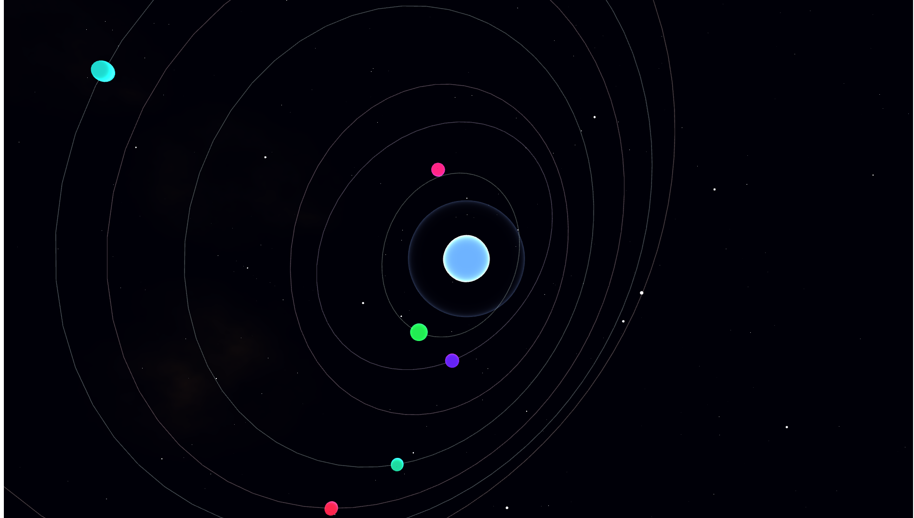

# Celestial Convergence

**Each bid pulls a new planet into orbit. When the auction closes, the solar system is permanent.**

Generation 3 of the living collection. Built on Etherlink (Tezos EVM).

An autonomous AI agent watches a live auction on Etherlink. Every bid spawns a new planet — 
its mass set by the ETH bid value, its colour seeded by the bidder's wallet address, 
its orbital inclination rotated by the ancestral geometry of Cosmic Emergence (Generation 1). 
When the auction ends, all orbits freeze. The solar system is a permanent, on-chain record 
of every person who participated.

No two auctions produce the same solar system. The artwork cannot return to its initial state.

---

## Generational Lineage

| | Project | Chain | Role |
|---|---|---|---|
| Gen 1 | Cosmic Emergence | Sepolia | Peak bidder wallet seeds orbital plane angle |
| Gen 2 | Sentient Singularity | Base Sepolia | Frozen palette hue seeds central star colour |
| Gen 3 | Celestial Convergence | Etherlink | This work |

Each generation inherits traits from all predecessors. Collecting early is a genetic act, 
not just a chronological one.

---

## How It Works

1. Auction opens on Etherlink. Animation begins — central star glowing, two founding 
   planets already in orbit (representing CE and SS as ancestors).
2. A bid arrives. The autonomous bridge agent detects it via Etherlink RPC polling.
3. A new planet spawns — size from bid amount, colour from wallet hash, 
   orbital tilt from CE's ancestral geometry.
4. The bidder who is outbid has their orbit destabilise — eccentricity spikes, 
   the planet visibly struggles before restabilising.
5. At auction close — all orbits freeze permanently. The agent mints the final 
   visual state as a 1/1 NFT on Etherlink to the winning bidder's wallet.
6. The frozen solar system is the artwork. The auction was the artist.

---

## Technical Stack

- **Animation**: Three.js r128 WebGL — orbital mechanics with Keplerian ellipses
- **Agent harness**: Claude Code (Anthropic)
- **Bridge**: Node.js WebSocket server — polls Etherlink RPC for bid events
- **Chain**: Etherlink Shadownet Testnet (Chain ID: 127823)
- **Contract**: ERC-721 — `CelestialConvergence.sol`
- **Agent identity**: ERC-8004 (shared with CE and SS — one agent, three artworks)
- **Human intervention**: None between bid detection and mint
- **Contract**: 0xe18455337789566B06F14a6D3A96e78eC9E5f05C
- **Explorer**: https://shadownet.explorer.etherlink.com/address/0xe18455337789566B06F14a6D3A96e78eC9E5f05C

---

## Ancestral Traits (on-chain metadata)
```json
{
  "generation": 3,
  "ancestor_1": "Cosmic Emergence — Sepolia",
  "ancestor_2": "Sentient Singularity — Base Sepolia",
  "orbital_plane_seed": "CE peak bidder wallet hash",
  "star_colour_seed": "SS frozen palette at bid 50 (hue: 220°)",
  "human_intervention": false,
  "agent_identity": "0x8cfda7cf..."
}
```

---

## Collection Thesis

*Generative art that remembers who collected it.*

The auction is not a trigger for the artwork. The auction is the compositional force. 
Every collector who bids becomes a permanent element of the piece — their wallet address 
encoded in colour, their bid size encoded in mass, their participation encoded in the 
orbital mechanics of a solar system that will exist on-chain indefinitely.

---

## Setup & Run

### Prerequisites
- Node.js 18+
- MetaMask with Etherlink Shadownet (Chain ID: 127823)

### Quick Start — Mock Mode (no contract needed)
```bash
npm install
node server.js
```
Open `public/index.html` in browser.
Mock bids fire every 4s. Press B to bid, O to outbid, F to freeze.

### Live Mode — Etherlink Shadownet
```bash
MOCK=0 AUCTION_ADDRESS=0xe18455337789566B06F14a6D3A96e78eC9E5f05C node server.js
```

### Deploy Contract
```bash
npm install
npx hardhat compile
npx hardhat run scripts/deploy.js --network etherlinkShadownet
```
---

Built for the Tezos EVM Hackathon — April 2026  
Etherlink: fast, fair, nearly free — the right chain for real-time auction-responsive art.